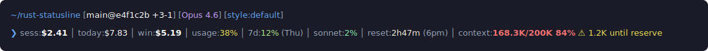
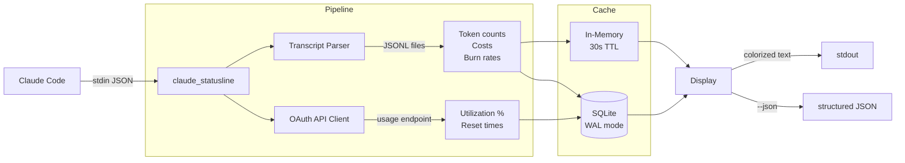

<div align="center">

# claude_statusline

**Live cost, usage, burn rate, context, and Git status for Claude Code**

[](https://github.com/camjac251/rust-statusline/actions/workflows/ci.yml)
[](https://github.com/camjac251/rust-statusline/actions/workflows/release.yml)
[](https://www.rust-lang.org/)
[](LICENSE)

A fast, single-binary statusline for [Claude Code](https://code.claude.com/docs). Parses session transcripts and the OAuth usage API to show real-time metrics in one line.

[Installation](#installation) · [What It Shows](#what-it-shows) · [CLI](#cli) · [JSON Output](#json-output) · [Architecture](#architecture)



</div>

---

## Installation

### Option 1: mise (Recommended)

If you use [mise](https://mise.jdx.dev/) for tool management:

```bash
mise use -g "github:camjac251/rust-statusline@latest"
```

Or add to `~/.config/mise/config.toml`:

```toml
[tools]
"github:camjac251/rust-statusline" = { version = "latest", bin = "claude_statusline" }
```

### Option 2: Download Binary

```bash
# Linux x64
curl -fsSL https://github.com/camjac251/rust-statusline/releases/latest/download/claude_statusline-linux-x86_64 \
  -o ~/.claude/claude_statusline && chmod +x ~/.claude/claude_statusline

# Linux ARM64
curl -fsSL https://github.com/camjac251/rust-statusline/releases/latest/download/claude_statusline-linux-arm64 \
  -o ~/.claude/claude_statusline && chmod +x ~/.claude/claude_statusline

# macOS Apple Silicon
curl -fsSL https://github.com/camjac251/rust-statusline/releases/latest/download/claude_statusline-macos-arm64 \
  -o ~/.claude/claude_statusline && chmod +x ~/.claude/claude_statusline

# macOS Intel
curl -fsSL https://github.com/camjac251/rust-statusline/releases/latest/download/claude_statusline-macos-x86_64 \
  -o ~/.claude/claude_statusline && chmod +x ~/.claude/claude_statusline
```

### Option 3: Build from Source

Requires Rust 1.88+:

```bash
git clone https://github.com/camjac251/rust-statusline
cd rust-statusline
cargo build --release
cp target/release/claude_statusline ~/.claude/
```

### Configure Claude Code

Add to `~/.claude/settings.json`:

```json
{
  "statusLine": {
    "type": "command",
    "command": "~/.claude/claude_statusline --hints"
  }
}
```

Restart Claude Code. Done.

---

## What It Shows

| Metric | Description |
|--------|-------------|
| **session** | Cost of the current session |
| **today** | Aggregated cost across all concurrent sessions (via SQLite) |
| **window** | Cost within the current 5-hour usage window |
| **usage%** | OAuth-reported utilization and projected usage |
| **burn** | Tokens per minute and cost per hour |
| **context** | Token count and percentage of context window used |
| **reset** | Time remaining until usage window reset |
| **git** | Branch, commit, dirty state, ahead/behind |

---

## How It Works



Pricing is embedded at compile time from `pricing.json`. The OAuth API is optional -- if no credentials are available, the tool falls back to transcript-only metrics.

---

## CLI

```
claude_statusline [OPTIONS]
```

| Flag | Description |
|------|-------------|
| `--json` | Emit structured JSON instead of colorized text |
| `--hints` | Show warnings near limits, compact ETA, reset emphasis |
| `--labels <short\|long>` | Label verbosity (default: short) |
| `--time <auto\|12h\|24h>` | Time format (default: auto-detect from locale) |
| `--show-provider` | Show provider/key source in header |
| `--show-breakdown` | Show per-token-type breakdown and web search count |
| `--no-gastown` | Disable Gas Town multi-agent display |
| `--claude-config-dir <PATHS>` | Override Claude data roots (comma-separated) |

### Environment Variables

| Variable | Effect |
|----------|--------|
| `CLAUDE_STATUS_HINTS=1` | Same as `--hints` |
| `CLAUDE_TIME_FORMAT=12` | Force 12-hour time |
| `CLAUDE_CONTEXT_LIMIT=N` | Override context window size (tokens) |
| `CLAUDE_PROVIDER=...` | Override provider display (`firstParty` becomes `anthropic`) |
| `CLAUDE_CONFIG_DIR=...` | Comma-separated list of Claude data roots |
| `CLAUDE_DB_CACHE_DISABLE=1` | Disable SQLite cache, fall back to per-session scanning |
| `CLAUDE_STATUSLINE_FETCH_USAGE=0` | Disable OAuth usage API calls |
| `CLAUDE_PRICE_INPUT` | Override input token price (all four must be set) |
| `CLAUDE_PRICE_OUTPUT` | Override output token price |
| `CLAUDE_PRICE_CACHE_CREATE` | Override cache creation token price |
| `CLAUDE_PRICE_CACHE_READ` | Override cache read token price |

---

## JSON Output

Pass `--json` for machine-readable output. Key fields:

```json
{
  "model": { "id": "claude-sonnet-4-20250514", "display_name": "Claude Sonnet 4" },
  "session": { "cost_usd": 0.42 },
  "today": { "cost_usd": 3.14 },
  "window": {
    "cost_usd": 1.23,
    "remaining_minutes": 161,
    "usage_percent": 12.3,
    "tokens_per_minute": 1500.0,
    "cost_per_hour": 1.50
  },
  "context": {
    "tokens": 12345,
    "percent": 6,
    "limit": 200000,
    "headroom_tokens": 187655,
    "eta_minutes": 42
  },
  "git": {
    "branch": "main",
    "short_commit": "a3f1c2b",
    "is_clean": true,
    "ahead": 0,
    "behind": 0
  }
}
```

Full schema includes `provider`, `plan`, `reset_at`, `git.remote_url`, `git.worktree_count`, `git.is_linked_worktree`, and token breakdowns per window. Fields are added over time; consumers should tolerate unknown keys.

---

## Architecture

```
src/
├── main.rs          # Entry point
├── lib.rs           # Library root, public API
├── cli.rs           # Argument parsing with env var fallbacks
├── models/          # Data structures
│   ├── hook.rs      # Hook input (HookMessage)
│   ├── entry.rs     # Transcript entries
│   ├── block.rs     # Usage blocks
│   ├── message.rs   # Message types
│   ├── git.rs       # Git status
│   ├── ratelimit.rs # Rate limit info
│   ├── beads.rs     # Beads models
│   └── gastown.rs   # Gas Town models
├── usage.rs         # Transcript analysis, session/window/daily metrics, burn rates
├── usage_api.rs     # OAuth usage API client with SQLite-cached responses
├── pricing.rs       # Model pricing tables (compile-time from pricing.json)
├── cache.rs         # In-memory usage cache (30s TTL)
├── db.rs            # SQLite persistent cache (WAL mode, concurrent-safe)
├── display.rs       # Text (colorized) and JSON output formatting
├── window.rs        # Usage window calculations
├── git.rs           # Repository inspection via gix (feature-gated)
├── utils.rs         # Time formatting, path resolution, helpers
├── beads.rs         # Beads issue tracker integration
└── gastown.rs       # Gas Town multi-agent orchestration support
```

### Feature Flags

| Feature | Default | Effect | Size |
|---------|---------|--------|------|
| `git` | on | Git branch/commit/status via [gix](https://github.com/GitoxideLabs/gitoxide) | ~800 KB |
| `colors` | on | Terminal colors via [owo-colors](https://github.com/jam1garner/owo-colors) | ~50 KB |

Build without both for a minimal ~2.5 MB binary:

```bash
cargo build --release --no-default-features
```

---

## Development

```bash
cargo fmt                                              # format
cargo clippy --all-targets --all-features -- -D warnings  # lint
cargo test --all-features --verbose                    # test
```

CI runs all tests across Ubuntu, macOS, and Windows with stable and beta Rust, all feature combinations, and enforces a 7 MB binary size limit.

---

## License

[MIT](LICENSE)
