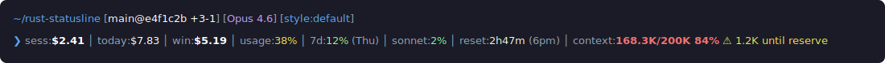
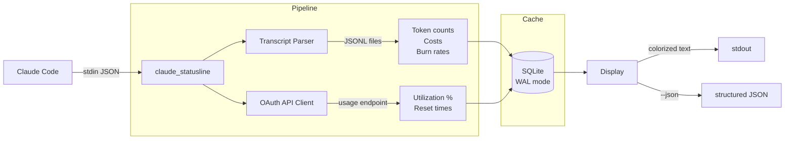

<div align="center">

# claude_statusline

**Live cost, usage, burn rate, context, and Git status for Claude Code**

[](https://github.com/camjac251/rust-statusline/actions/workflows/ci.yml)
[](https://github.com/camjac251/rust-statusline/actions/workflows/release.yml)
[](https://www.rust-lang.org/)
[](LICENSE)

A fast, single-binary statusline for [Claude Code](https://code.claude.com/docs). Parses session transcripts and the OAuth usage API to show real-time metrics in one line.

[Installation](#installation) · [What It Shows](#what-it-shows) · [CLI](#cli) · [JSON Output](#json-output) · [Architecture](#architecture)



</div>

---

## Installation

### Option 1: Homebrew (Recommended)

```bash
brew install camjac251/tap/claude-statusline
```

Upgrades work normally after the initial install:

```bash
brew upgrade claude-statusline
```

Bottles are built for macOS (arm64, x86_64) and Linux (arm64, x86_64). Formulas are updated automatically when new releases are published.

### Option 2: Download Binary

```bash
# Linux x64
curl -fsSL https://github.com/camjac251/rust-statusline/releases/latest/download/claude_statusline-linux-x86_64 \
  -o ~/.local/bin/claude_statusline && chmod +x ~/.local/bin/claude_statusline

# Linux ARM64
curl -fsSL https://github.com/camjac251/rust-statusline/releases/latest/download/claude_statusline-linux-arm64 \
  -o ~/.local/bin/claude_statusline && chmod +x ~/.local/bin/claude_statusline

# macOS Apple Silicon
curl -fsSL https://github.com/camjac251/rust-statusline/releases/latest/download/claude_statusline-macos-arm64 \
  -o ~/.local/bin/claude_statusline && chmod +x ~/.local/bin/claude_statusline

# macOS Intel
curl -fsSL https://github.com/camjac251/rust-statusline/releases/latest/download/claude_statusline-macos-x86_64 \
  -o ~/.local/bin/claude_statusline && chmod +x ~/.local/bin/claude_statusline
```

### Option 3: Build from Source

Requires Rust 1.88+:

```bash
git clone https://github.com/camjac251/rust-statusline
cd rust-statusline
cargo build --release
cp target/release/claude_statusline ~/.local/bin/
```

### Configure Claude Code

Add to `~/.claude/settings.json`:

```json
{
  "statusLine": {
    "type": "command",
    "command": "claude_statusline",
    "padding": 0,
    "refreshInterval": 5
  }
}
```

`padding` and `refreshInterval` are Claude Code settings. `claude_statusline` just renders the current snapshot when Claude Code invokes it.

Claude Code truncates long footer output, so `claude_statusline` now prefers a more compact, Claude-safe layout unless there is clear room for the richer two-line view.

Restart Claude Code. Done.

---

## What It Shows

| Metric | Description |
|--------|-------------|
| **session** | Cost of the current session (includes subagent costs) |
| **today** | Aggregated cost across all concurrent sessions (via SQLite usage ledger) |
| **window** | Cost within the current 5-hour usage window |
| **usage%** | OAuth-reported utilization and projected usage |
| **burn** | Tokens per minute and cost per hour |
| **context** | Token count and percentage of context window used |
| **reset** | Time remaining until usage window reset |
| **git** | Branch, commit, dirty state, ahead/behind |
| **workspace** | Added workspace dirs and linked worktree hints from Claude Code |

---

## How It Works


```mermaid
flowchart LR
    CC[Claude Code] -->|stdin JSON| SL[claude_statusline]

    subgraph Pipeline
        direction TB
        SL --> TP[Transcript Parser]
        SL --> OA[OAuth API Client]
        TP -->|JSONL files| METRICS[Token counts\nCosts\nBurn rates]
        OA -->|usage endpoint| UTIL[Utilization %\nReset times]
    end

    subgraph Cache
        direction TB
        METRICS --> DB[(SQLite\nWAL mode)]
        UTIL --> DB
    end

    DB --> OUT[Display]
    OUT -->|colorized text| STDOUT[stdout]
    OUT -->|--json| JSON[structured JSON]
```

Pricing is embedded at compile time from `pricing.json`. The OAuth API is optional -- if no credentials are available, the tool falls back to transcript-only metrics.

---

## CLI

```
claude_statusline [OPTIONS]
claude_statusline doctor [OPTIONS]
claude_statusline init [OPTIONS]
```

**Mode selectors**

| Flag | Description |
|------|-------------|
| `--json` | Emit structured JSON instead of colorized text |
| `--config <PATH>` | Load a config file |
| `--no-config` | Disable config file loading |
| `--preset <minimal\|default\|full>` | Apply a built-in preset (atomic flags still win) |
| `--prompt-cache-ttl-seconds <N>` | Fallback TTL when transcripts only expose aggregate cache creation (default: 300) |
| `--labels <short\|long>` | Label verbosity (default: short) |
| `--time <auto\|12h\|24h>` | Time format (default: auto-detect from locale) |
| `--window-anchor <provider\|log>` | Window alignment (default: provider) |
| `--window-scope <global\|project>` | Window cost scope (default: global) |
| `--burn-scope <session\|global>` | Burn rate scope (default: session) |
| `--git <minimal\|verbose>` | Git header verbosity (default: minimal) |
| `--truecolor` | Force truecolor accents |
| `--debug` | Show detailed calculation info to stderr |
| `--claude-config-dir <PATHS>` | Override Claude data roots (comma-separated) |

**Subsystem toggles** (skip the work entirely; affects text + JSON)

| Flag | Description |
|------|-------------|
| `--no-subsystem-git` | Skip gix repository inspection |
| `--no-subsystem-beads` | Skip beads issue tracker integration |
| `--no-subsystem-gastown` | Skip Gas Town multi-agent integration |
| `--no-subsystem-db-cache` | Skip SQLite global usage cache (falls back to per-session scan) |
| `--no-subsystem-usage-api` | Skip OAuth usage API calls |

**Display toggles** (text rendering only; JSON shape unchanged). Default-on tokens use `--no-<section>-<element>`; default-off opt-ins use `--<section>-<element>`.

| Group | Flag | Default | Controls |
|-------|------|---------|----------|
| cost | `--no-cost-session` | on | `session:$X` token |
| cost | `--no-cost-today` | on | `today:$X` token |
| cost | `--no-cost-window` | on | `window:$X` token (Claude direct only) |
| cost | `--cost-breakdown` | off | `tok:I/O cache:C/R ws:N` segment |
| cost | `--cost-provenance` | off | `src:/today:/price:` suffix |
| cost | `--no-cost-lines-delta` | on | `+a -b` lines token in header |
| usage | `--no-usage-five-hour` | on | `usage:X%` + reset inline |
| usage | `--no-usage-weekly` | on | `weekly:X%` / `7d:X%` token |
| usage | `--no-usage-opus` | on | `opus:X%` token |
| usage | `--no-usage-sonnet` | on | `sonnet:X%` token |
| usage | `--no-usage-extra` | on | paid-overage token |
| context | `--no-context-tokens` | on | token count side of `ctx:N/L` |
| context | `--no-context-percent` | on | percent side of `ctx:N/L X%` |
| context | `--no-context-compact-hint` | on | `compact:@NK ~Nm` chip |
| git | `--no-git-branch` | on | branch name in git header segment |
| git | `--no-git-dirty` | on | dirty / clean indicator |
| git | `--no-git-ahead-behind` | on | ahead / behind counts |
| git | `--no-git-worktree` | on | worktree header segment |
| workspace | `--no-workspace-cwd` | on | cwd in header |
| workspace | `--no-workspace-added-dirs` | on | added-dirs segment |
| workspace | `--no-workspace-model` | on | model name segment |
| workspace | `--no-workspace-fast-mode-indicator` | on | fast-mode badge on the model segment |
| workspace | `--no-workspace-agent` | on | subagent name segment |
| workspace | `--no-workspace-output-style` | on | output-style segment |
| workspace | `--no-workspace-effort` | on | effort-level segment |
| integrations | `--no-integrations-beads` | on | beads current-work + open count segment |
| integrations | `--no-integrations-beads-alerts` | on | beads P0 + blocked alert segment |
| integrations | `--no-integrations-gastown` | on | gastown header segment |
| integrations | `--no-integrations-prompt-cache` | on | prompt-cache countdown token |
| provider | `--provider-key-source` | off | `key:X` hint |
| provider | `--provider-name` | off | `prov:Y` hint |

**JSON-only toggles** (omit fields from `--json` output)

| Flag | Default | Controls |
|------|---------|----------|
| `--no-json-subagents` | on | `session.subagents` |
| `--no-json-tokens-breakdown` | on | per-token-kind fields in `session.tokens` and `window.*` |
| `--no-json-duration` | on | `session.duration_ms`, `api_duration_ms`, `cost_per_hour`, `lines_added`, `lines_removed` |
| `--no-json-rate-limit` | on | top-level `rate_limit` object |
| `--no-json-usage-limits` | on | top-level `usage_limits` object |
| `--no-json-compat-aliases` | on | top-level `cwd`, `project_dir`, `fast_mode`, and `block` (clone of `window`) |

### Presets

Three built-in presets configure groups of toggles at once. Atomic CLI / env / TOML flags still win over the preset values.

- `minimal`: cwd + model + session cost + 5-hour usage + context percent. Skips beads, gastown, OAuth usage API, and most secondary tokens.
- `default`: the README baseline (this is the unset state; pass it to reset after experimenting).
- `full`: everything in `default` plus the opt-in tokens (`cost.breakdown`, `cost.provenance`, `provider.key_source`, `provider.name`).

Apply via CLI, env, or TOML:

```bash
claude_statusline --preset minimal
CLAUDE_STATUSLINE_PRESET=full claude_statusline
```

```toml
[display]
preset = "minimal"
```

### Setup and diagnostics

```bash
claude_statusline doctor
claude_statusline doctor --json
claude_statusline init
claude_statusline init --dry-run
claude_statusline init --refresh-interval 5
```

`doctor` checks Claude config paths, `settings.json`, SQLite cache health, OAuth cache/token availability, config loading, and pricing lookup provenance without reading statusline stdin.

`init` writes the Claude Code `statusLine` block to `settings.json`:

```json
{
  "statusLine": {
    "type": "command",
    "command": "claude_statusline",
    "padding": 0,
    "refreshInterval": 5
  }
}
```

### Config file

Config files are optional. Precedence is:

```text
defaults < config file < environment < CLI
```

Discovery order:

1. `--config <PATH>` or `CLAUDE_STATUSLINE_CONFIG`
2. `./.claude-statusline.toml`
3. `~/.config/claude-statusline/config.toml`

Supported keys mirror the stable CLI options:

```toml
# Mode selectors (top-level under [display])
[display]
preset = "default"   # minimal | default | full; or omit
labels = "long"
git = "verbose"
prompt_cache_ttl_seconds = 300
truecolor = true
window_scope = "global"
burn_scope = "session"
window_anchor = "provider"

# Subsystem skip-work toggles. true = enabled (default), false = skip the work.
[subsystems]
git = true
beads = true
gastown = true
db_cache = true
usage_api = true

# Display atomic toggles. true = visible (default for most), false = hidden.
# breakdown / provenance / provider.* default to false (opt-in).
[display.cost]
session = true
today = true
window = true
breakdown = false
provenance = false
lines_delta = true

[display.usage]
five_hour = true
weekly = true
opus = true
sonnet = true
extra = true

[display.context]
tokens = true
percent = true
compact_hint = true

[display.git]
branch = true
dirty = true
ahead_behind = true
worktree = true

[display.workspace]
cwd = true
added_dirs = true
model = true
fast_mode_indicator = true
agent = true
output_style = true
effort = true

[display.integrations]
beads = true
beads_alerts = true
gastown = true
prompt_cache = true

[display.provider]
key_source = false
name = false

# JSON-only opt-outs (only affect --json output)
[json]
subagents = true
tokens_breakdown = true
duration = true
rate_limit = true
usage_limits = true
compat_aliases = true
```

### Environment Variables

| Variable | Effect |
|----------|--------|
| `CLAUDE_STATUSLINE_CONFIG=...` | Explicit config file path |
| `CLAUDE_PROMPT_CACHE_TTL_SECONDS=N` | Override prompt-cache TTL |
| `CLAUDE_TIME_FORMAT=12` | Force 12-hour time |
| `CLAUDE_CONTEXT_LIMIT=N` | Override context window size (tokens) |
| `CLAUDE_PROVIDER=...` | Override provider display (`firstParty` becomes `anthropic`) |
| `CLAUDE_CONFIG_DIR=...` | Comma-separated list of Claude data roots |
| `CLAUDE_STATUSLINE_SUBSYSTEM_NO_GIT=true` | Skip gix repository inspection entirely |
| `CLAUDE_STATUSLINE_SUBSYSTEM_NO_BEADS=true` | Skip beads issue tracker integration |
| `CLAUDE_STATUSLINE_SUBSYSTEM_NO_GASTOWN=true` | Skip Gas Town multi-agent integration |
| `CLAUDE_STATUSLINE_SUBSYSTEM_NO_DB_CACHE=true` | Skip SQLite global usage cache |
| `CLAUDE_STATUSLINE_SUBSYSTEM_NO_USAGE_API=true` | Skip OAuth usage API calls |
| `CLAUDE_PRICE_INPUT` | Override input token price (all four must be set) |
| `CLAUDE_PRICE_OUTPUT` | Override output token price |
| `CLAUDE_PRICE_CACHE_CREATE` | Override cache creation token price |
| `CLAUDE_PRICE_CACHE_READ` | Override cache read token price |

---

## JSON Output

Pass `--json` for machine-readable output. Key fields:

```json
{
  "model": { "id": "claude-opus-4-6", "display_name": "Claude Opus 4.6" },
  "workspace": {
    "current_dir": "/repo",
    "project_dir": "/repo",
    "added_dirs": ["/repo/docs"],
    "git_worktree": "feature/footer"
  },
  "session": {
    "cost_usd": 0.42,
    "cost_source": "transcript_result",
    "subagents": [
      { "agent_id": "a1234567890abcdef", "cost_usd": 0.15, "input_tokens": 50000, "output_tokens": 2000 }
    ]
  },
  "today": { "cost_usd": 3.14, "cost_source": "db_global_usage" },
  "window": {
    "cost_usd": 1.23,
    "remaining_minutes": 161,
    "usage_percent": 12.3,
    "tokens_per_minute": 1500.0,
    "cost_per_hour": 1.50
  },
  "context": {
    "tokens": 12345,
    "percent": 6,
    "limit": 200000,
    "usable_limit": 168000,
    "usable_percent": 8,
    "headroom_tokens": 187655,
    "eta_minutes": 42
  },
  "prompt_cache": {
    "ttl_seconds": 300,
    "age_seconds": 60,
    "write_age_seconds": 180,
    "read_age_seconds": 60,
    "remaining_seconds": 120,
    "percent_remaining": 40.0,
    "cache_read_input_tokens": 8000,
    "last_activity_at": "2026-05-01T12:02:00+00:00",
    "last_cache_write_at": "2026-05-01T12:00:00+00:00",
    "last_cache_read_at": "2026-05-01T12:02:00+00:00",
    "buckets": [
      { "kind": "5m", "input_tokens": 5000, "ttl_seconds": 300, "remaining_seconds": 120 }
    ]
  },
  "provenance": {
    "session_cost": "transcript_result",
    "today_cost": "db_global_usage",
    "pricing": "embedded",
    "context": "hook"
  },
  "git": {
    "branch": "main",
    "short_commit": "a3f1c2b",
    "is_clean": true,
    "ahead": 0,
    "behind": 0
  },
  "remote": {
    "session_id": "remote-abc"
  }
}
```

Full schema includes `provider`, `plan`, `reset_at`, `session.subagents`, `prompt_cache`, `provenance`, `git.remote_url`, `git.worktree_count`, `git.is_linked_worktree`, nested `workspace.*`, optional `remote.session_id`, and token breakdowns per window. Top-level `cwd` and `project_dir` remain as compatibility aliases. Fields are added over time; consumers should tolerate unknown keys.

---

## Architecture

```
src/
├── main.rs          # Entry point
├── lib.rs           # Library root, public API
├── cli.rs           # Argument parsing with env var fallbacks
├── config.rs        # Config file discovery and precedence
├── doctor.rs        # Diagnostics and statusLine installer
├── models/          # Data structures
│   ├── hook.rs      # Hook input (HookMessage)
│   ├── entry.rs     # Transcript entries
│   ├── block.rs     # Usage blocks
│   ├── message.rs   # Message types
│   ├── git.rs       # Git status
│   ├── ratelimit.rs # Rate limit info
│   ├── beads.rs     # Beads models
│   └── gastown.rs   # Gas Town models
├── usage.rs         # Transcript analysis, session/window/daily metrics, burn rates
├── usage_api.rs     # OAuth usage API client with SQLite-cached responses
├── pricing.rs       # Model pricing tables (compile-time from pricing.json)
├── provenance.rs    # Cost/pricing/context source metadata
├── db.rs            # SQLite persistent cache and usage event ledger (WAL mode)
├── display.rs       # Text (colorized) and JSON output formatting
├── window.rs        # Usage window calculations
├── git.rs           # Repository inspection via gix (feature-gated)
├── utils.rs         # Time formatting, path resolution, helpers
├── beads.rs         # Beads issue tracker integration
└── gastown.rs       # Gas Town multi-agent orchestration support
```

### Feature Flags

| Feature | Default | Effect | Size |
|---------|---------|--------|------|
| `git` | on | Git branch/commit/status via [gix](https://github.com/GitoxideLabs/gitoxide) | ~800 KB |
| `colors` | on | Terminal colors via [owo-colors](https://github.com/jam1garner/owo-colors) | ~50 KB |

Build without both for a minimal ~2.5 MB binary:

```bash
cargo build --release --no-default-features
```

---

## Development

```bash
cargo fmt                                              # format
cargo clippy --all-targets --all-features -- -D warnings  # lint
cargo test --all-features --verbose                    # test
```

CI runs all tests across Ubuntu, macOS, and Windows with stable and beta Rust, all feature combinations, and enforces a 7 MB binary size limit.

---

## License

[MIT](LICENSE)
