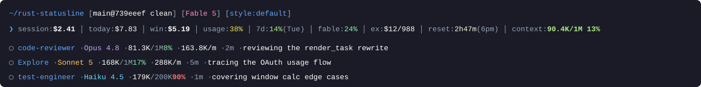
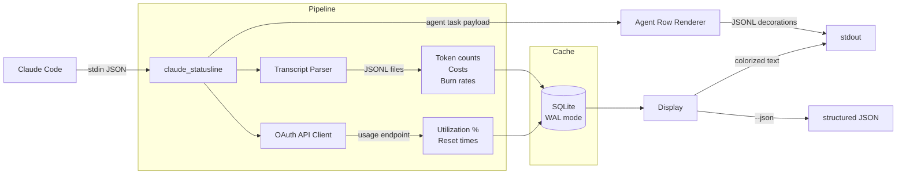

<div align="center">

# claude_statusline

**Live cost, usage, burn rate, context, and Git status for Claude Code**

[](https://github.com/camjac251/rust-statusline/actions/workflows/ci.yml)
[](https://github.com/camjac251/rust-statusline/actions/workflows/release.yml)
[](https://www.rust-lang.org/)
[](LICENSE)

A fast, single-binary statusline for [Claude Code](https://code.claude.com/docs). Parses session transcripts and the OAuth usage API to show real-time metrics in one line. Provider-qualified `clodex:` model identifiers are normalized for display and embedded cost calculation, including GPT-5.6 Sol, Terra, and Luna.

[Installation](#installation) · [What It Shows](#what-it-shows) · [CLI](#cli) · [JSON Output](#json-output) · [Architecture](#architecture)



</div>

---

## Installation

### Option 1: Homebrew (Recommended)

```bash
brew install camjac251/tap/claude-statusline
```

Upgrades work normally after the initial install:

```bash
brew upgrade claude-statusline
```

Bottles are built for macOS (arm64, x86_64) and Linux (arm64, x86_64). Formulas are updated automatically when new releases are published.

### Option 2: Download Binary

```bash
# Linux x64
curl -fsSL https://github.com/camjac251/rust-statusline/releases/latest/download/claude_statusline-linux-x86_64 \
  -o ~/.local/bin/claude_statusline && chmod +x ~/.local/bin/claude_statusline

# Linux ARM64
curl -fsSL https://github.com/camjac251/rust-statusline/releases/latest/download/claude_statusline-linux-arm64 \
  -o ~/.local/bin/claude_statusline && chmod +x ~/.local/bin/claude_statusline

# macOS Apple Silicon
curl -fsSL https://github.com/camjac251/rust-statusline/releases/latest/download/claude_statusline-macos-arm64 \
  -o ~/.local/bin/claude_statusline && chmod +x ~/.local/bin/claude_statusline

# macOS Intel
curl -fsSL https://github.com/camjac251/rust-statusline/releases/latest/download/claude_statusline-macos-x86_64 \
  -o ~/.local/bin/claude_statusline && chmod +x ~/.local/bin/claude_statusline
```

### Option 3: Build from Source

Requires Rust 1.95+:

```bash
git clone https://github.com/camjac251/rust-statusline
cd rust-statusline
cargo build --release
cp target/release/claude_statusline ~/.local/bin/
```

### Configure Claude Code

Add to `~/.claude/settings.json`:

```json
{
  "statusLine": {
    "type": "command",
    "command": "claude_statusline",
    "padding": 0,
    "refreshInterval": 5
  },
  "subagentStatusLine": {
    "type": "command",
    "command": "claude_statusline"
  }
}
```

`padding` and `refreshInterval` are Claude Code settings for the footer. `subagentStatusLine` is optional and customizes rows in the agent panel. Claude Code sends all eligible local-agent tasks to the command every five seconds; `claude_statusline` detects that payload automatically and returns the required per-task JSONL decorations.

Claude Code truncates long footer output, so `claude_statusline` prefers a more compact, Claude-safe layout unless there is clear room for the richer two-line view. When Claude Code provides `COLUMNS` and `LINES`, those dimensions drive the layout: important segments reduce through shorter labels first, compact mode can show the project folder when useful, model names collapse to readable family names, and low-priority workspace/detail segments drop when that keeps the line more readable. Agent-panel rows use the per-row `columns` budget from Claude Code and reduce through shorter variants before truncating. Width reduction sheds fields in a fixed order: the tokens-per-minute burn chip first, then the effort chip, then the current-task detail, so the name/model/context/elapsed core survives longest.

Restart Claude Code. Done.

---

## What It Shows

| Metric | Description |
|--------|-------------|
| **session** | Cost of the current session (includes subagent costs) |
| **today** | Aggregated cost across all concurrent sessions (via SQLite usage ledger) |
| **window** | Cost within the current 5-hour usage window |
| **usage%** | OAuth-reported session, weekly, scoped model, and extra-usage utilization |
| **burn** | Tokens per minute and cost per hour |
| **context** | Token count and percentage of context window used |
| **reset** | Time remaining until usage window reset |
| **up** | How old the usage figures are, e.g. `up:15m`. Absent while they are current, so it appears only when a refresh was due and did not land |
| **model** | Friendly model identity with family-specific ANSI or truecolor styling |
| **git** | Branch, commit, dirty state, ahead/behind |
| **workspace** | Added workspace dirs and linked worktree hints from Claude Code |
| **agents** | Live agent-panel rows: name, model, effort, context usage, burn rate, elapsed time, and current task (Claude Code draws the status glyph in its own gutter) |

---

## How It Works


```mermaid
flowchart LR
    CC[Claude Code] -->|stdin JSON| SL[claude_statusline]
    SL -->|agent task payload| SA[Agent Row Renderer]

    subgraph Pipeline
        direction TB
        SL --> TP[Transcript Parser]
        SL --> OA[OAuth API Client]
        TP -->|JSONL files| METRICS[Token counts\nCosts\nBurn rates]
        OA -->|usage endpoint| UTIL[Utilization %\nReset times]
    end

    subgraph Cache
        direction TB
        METRICS --> DB[(SQLite\nWAL mode)]
        UTIL --> DB
    end

    DB --> OUT[Display]
    OUT -->|colorized text| STDOUT[stdout]
    OUT -->|--json| JSON[structured JSON]
    SA -->|JSONL decorations| STDOUT
```

Pricing is embedded at compile time from `pricing.json`. Namespaced identifiers such as `clodex:openai-oauth:gpt-5.6-sol` retain their provider provenance while displaying a compact name such as `GPT-5.6 Sol`. The OAuth API is optional. If no credentials are available, the tool falls back to transcript-only metrics.

When stdin contains Claude Code's `subagentStatusLine` task payload, the binary switches to agent-panel mode without a separate flag. It emits one `{id, content}` JSON object per task as JSONL and does not perform transcript, Git, database, or API work. Each row can carry a burn chip (e.g. `12.3K/m`) derived from the payload's token samples, which arrive one per five-second tick; tasks with fewer than two samples or no token growth omit it. Rows also carry an effort chip (`none`, `low`, `medium`, `high`, `xhigh`, `max`) colored on the same tier scale as the main line when Claude Code reports a named effort for the agent; agents whose model exposes no effort, or that report an integer level, show no chip. With `--json`, this mode emits a single structured `{"tasks": [...]}` object with the parsed task rows (snake_case keys, absent optional fields omitted) instead of the JSONL decorations; rows include a numeric `tokens_per_minute` field when the burn rate is derivable.

Newer OAuth usage responses expose canonical rows through generic `limits[]` and `spend` fields. `claude_statusline` preserves those rows, uses them as fallbacks for session/weekly percentages, renders scoped weekly model rows such as `fable:24%`, and maps `spend` into the extra-usage credit token.

### Model pricing and colors

Embedded GPT-5.6 prices follow the [OpenAI pricing reference](https://platform.openai.com/docs/pricing). Rates below are USD per million tokens:

| Model | Input | Output | Cache write | Cache read |
|-------|------:|-------:|------------:|-----------:|
| GPT-5.6 Sol | $5.00 | $30.00 | $6.25 | $0.50 |
| GPT-5.6 Terra | $2.50 | $15.00 | $3.125 | $0.25 |
| GPT-5.6 Luna | $1.00 | $6.00 | $1.25 | $0.10 |

For any of these models, a request above 272,000 input tokens uses long-context pricing for the full request: input and cache tokens cost 2x, while output tokens cost 1.5x. Exactly 272,000 input tokens remains at the standard rate; 272,001 activates the long-context tier. Claude model rates continue to use the embedded [Anthropic pricing reference](https://platform.claude.com/docs/en/about-claude/pricing) across their supported context windows.

Model names use a stable identity palette independent of cost, context pressure, and effort colors:

| Model | Truecolor | ANSI fallback |
|-------|-----------|---------------|
| Fable | rose `#FF8CBE` | magenta |
| Opus | lavender `#C8A0FF` | bright magenta |
| Sonnet | amber `#FFC864` | bright yellow |
| Haiku | cyan `#64DCFF` | bright cyan |
| GPT-5.6 Sol | coral-orange `#FF7A59` | red |
| GPT-5.6 Terra | green `#69DB94` | green |
| GPT-5.6 Luna | periwinkle-blue `#7DAAFF` | bright blue |

Truecolor is auto-detected from common terminal environment variables, and `--truecolor` or `CLAUDE_TRUECOLOR=1` forces it. [`NO_COLOR`](https://no-color.org/) disables all ANSI and truecolor styling.

---

## CLI

```
claude_statusline [OPTIONS]
claude_statusline --version
claude_statusline doctor [OPTIONS]
claude_statusline init [OPTIONS]
```

**Mode selectors**

| Flag | Description |
|------|-------------|
| `--json` | Emit structured JSON instead of colorized text |
| `--version` | Print the installed binary version |
| `--config <PATH>` | Load a config file |
| `--no-config` | Disable config file loading |
| `--preset <minimal\|default\|full>` | Apply a built-in preset (atomic flags still win) |
| `--prompt-cache-ttl-seconds <N>` | Fallback TTL when transcripts only expose aggregate cache creation (default: 300) |
| `--labels <short\|long>` | Label verbosity (default: short) |
| `--time <auto\|12h\|24h>` | Time format (default: auto-detect from locale) |
| `--window-anchor <provider\|log>` | Window alignment (default: provider) |
| `--window-scope <global\|project>` | Window cost scope (default: global) |
| `--burn-scope <session\|global>` | Burn rate scope (default: session) |
| `--git <minimal\|verbose>` | Git header verbosity (default: minimal) |
| `--truecolor` | Force truecolor accents |
| `--debug` | Show detailed calculation info to stderr (includes the usage API egress route) |
| `--claude-config-dir <PATHS>` | Override Claude data roots (comma-separated) |

**Subsystem toggles** (skip the work entirely; affects text + JSON)

| Flag | Description |
|------|-------------|
| `--no-subsystem-git` | Skip gix repository inspection |
| `--no-subsystem-beads` | Skip beads issue tracker integration |
| `--no-subsystem-gastown` | Skip Gas Town multi-agent integration |
| `--no-subsystem-db-cache` | Skip SQLite global usage cache (falls back to per-session scan) |
| `--no-subsystem-usage-api` | Skip OAuth usage API calls |

**Display toggles** (text rendering only; JSON shape unchanged). Default-on tokens use `--no-<section>-<element>`; default-off opt-ins use `--<section>-<element>`.

Scoped weekly model rows from the OAuth usage API render from the model metadata in `limits[]` (`fable:`, `mythos:`, `opus:`, `sonnet:`, `haiku:`, or a sanitized model label). The Opus and Sonnet hide flags also suppress matching scoped rows; other scoped families are shown when present.

| Group | Flag | Default | Controls |
|-------|------|---------|----------|
| cost | `--no-cost-session` | on | `session:$X` token |
| cost | `--no-cost-today` | on | `today:$X` token |
| cost | `--no-cost-window` | on | `window:$X` token (Claude direct only) |
| cost | `--cost-breakdown` | off | `tok:I/O cache:C/R ws:N` segment |
| cost | `--cost-provenance` | off | `src:/today:/price:` suffix |
| cost | `--no-cost-lines-delta` | on | `+a -b` lines token in header |
| usage | `--no-usage-five-hour` | on | `usage:X%` + reset inline |
| usage | `--no-usage-weekly` | on | `weekly:X%` / `7d:X%` token |
| usage | `--no-usage-age` | on | `up:N` token, shown only once the usage figures outlive their refresh window |
| usage | `--no-usage-opus` | on | `opus:X%` legacy or scoped family token |
| usage | `--no-usage-sonnet` | on | `sonnet:X%` legacy or scoped family token |
| usage | `--no-usage-extra` | on | paid extra-usage credit token |
| context | `--no-context-tokens` | on | token count side of `ctx:N/L` |
| context | `--no-context-percent` | on | percent side of `ctx:N/L X%` |
| context | `--no-context-compact-hint` | on | `compact:@NK ~Nm` chip |
| git | `--no-git-branch` | on | branch name in git header segment |
| git | `--no-git-dirty` | on | dirty / clean indicator |
| git | `--no-git-ahead-behind` | on | ahead / behind counts |
| git | `--no-git-worktree` | on | worktree header segment |
| workspace | `--no-workspace-cwd` | on | cwd in header |
| workspace | `--no-workspace-added-dirs` | on | added-dirs segment |
| workspace | `--no-workspace-model` | on | model name segment |
| workspace | `--no-workspace-fast-mode-indicator` | on | fast-mode badge on the model segment |
| workspace | `--no-workspace-agent` | on | subagent name segment |
| workspace | `--no-workspace-output-style` | on | output-style segment |
| workspace | `--no-workspace-effort` | on | effort-level segment |
| integrations | `--no-integrations-beads` | on | beads current-work + open count segment |
| integrations | `--no-integrations-beads-alerts` | on | beads P0 + blocked alert segment |
| integrations | `--no-integrations-gastown` | on | gastown header segment |
| integrations | `--no-integrations-prompt-cache` | on | prompt-cache status and optional read/write token details |
| integrations | `--no-integrations-workflows` | on | running-workflow `wf:name done/total` segment |
| integrations | `--no-integrations-remote-tasks` | on | remote-agent task-count `rt:N` segment |
| provider | `--provider-key-source` | off | `key:X` hint |
| provider | `--provider-name` | off | `prov:Y` hint |

At narrower widths, prompt-cache read/write token details collapse before the cache status is dropped.

**JSON-only toggles** (omit fields from `--json` output)

| Flag | Default | Controls |
|------|---------|----------|
| `--no-json-subagents` | on | `session.subagents` |
| `--no-json-tokens-breakdown` | on | per-token-kind fields in `session.tokens` and `window.*` |
| `--no-json-duration` | on | `session.duration_ms`, `api_duration_ms`, `cost_per_hour`, `lines_added`, `lines_removed` |
| `--no-json-rate-limit` | on | top-level `rate_limit` object |
| `--no-json-usage-limits` | on | top-level `usage_limits` object |

### Presets

Three built-in presets configure groups of toggles at once. Atomic CLI / env / TOML flags still win over the preset values.

- `minimal`: cwd + model + session cost + 5-hour usage + context percent. Skips beads, gastown, OAuth usage API, and most secondary tokens.
- `default`: the README baseline (this is the unset state; pass it to reset after experimenting).
- `full`: everything in `default` plus the opt-in tokens (`cost.breakdown`, `cost.provenance`, `provider.key_source`, `provider.name`).

Apply via CLI, env, or TOML:

```bash
claude_statusline --preset minimal
CLAUDE_STATUSLINE_PRESET=full claude_statusline
```

```toml
[display]
preset = "minimal"
```

### Setup and diagnostics

```bash
claude_statusline doctor
claude_statusline doctor --json
claude_statusline init
claude_statusline init --dry-run
claude_statusline init --refresh-interval 5
```

`doctor` checks Claude config paths, `settings.json` (both the `statusLine` and optional `subagentStatusLine` entries), SQLite cache health, OAuth cache/token availability, the usage API egress route (direct, or through a proxy resolved from `HTTPS_PROXY`/`NO_PROXY`, plus any `NODE_EXTRA_CA_CERTS` trust), config loading, and pricing lookup provenance without reading statusline stdin. A missing `subagentStatusLine` is reported on the settings line but never counts against `ok`. When `statusLine` is present but has no `refreshInterval`, `doctor` warns: Claude Code does not re-run the command on terminal resize, so the footer keeps stale, re-truncated output and timed metrics do not refresh between messages until the next message; `init` sets it.

The `usage_api` lines show the cache state and where the OAuth usage call goes (an excerpt):

```text
usage_api: direct=true token=true cache=false stale_cache=false negative_cache=false ttl=300s
usage_api egress: proxy http://proxy.internal:8080 (auth)
```

The route reads `direct` when no proxy applies. Credentials embedded in the proxy URL are masked. `ttl` is the effective positive-cache lifetime after any `CLAUDE_USAGE_CACHE_TTL_SECONDS` override; see [Usage API rate limits](#usage-api-rate-limits).

A further line appears only when the endpoint returns a field no released version maps:

```text
usage_api: unmapped response fields: some_new_slot
```

That is an early warning that the response schema grew, not an error.

**Proxy and TLS.** The usage API call follows the same proxy as Claude Code. It reads `HTTPS_PROXY`/`HTTP_PROXY`/`NO_PROXY` (upper or lower case) from the inherited environment, so whatever you set in your shell or in `settings.json` `env` applies with no extra configuration. For a TLS-intercepting proxy, point `NODE_EXTRA_CA_CERTS` at the proxy's CA bundle (PEM); it is trusted in addition to the system roots. Run `doctor` to confirm the resolved route.

### Usage API rate limits

The OAuth usage endpoint enforces a per-account budget of roughly **5 requests per fixed 300-second window**. The window is anchored at the first request in it, and exceeding the budget returns `429` with a `retry-after` header counting down to the reset. Extra `429`s do not extend the lockout.

`claude_statusline` stays inside that budget three ways:

- **Positive cache.** A successful response is reused for `CLAUDE_USAGE_CACHE_TTL_SECONDS` (default 300), so one machine spends one request per window. With `refreshInterval: 5`, roughly 1 statusline invocation in 60 touches the network.
- **Cross-session fetch lock.** Concurrent sessions on one machine do not each fetch. The first to take a short SQLite lock performs the call; the others read the cache. Sessions on a machine cost no extra requests.
- **Server-driven backoff.** A `429` arms the negative cache with the endpoint's own `retry-after` rather than a fixed guess, so the next attempt lands after the window reopens instead of burning further requests against a closed one.

The budget is per account, not per machine, and only the fetch lock is machine-local. Several machines on one account each spend a request per window, so the safe floor is `300 / machines` seconds:

| Machines on the account | Requests per 300s at default TTL | Safe TTL |
|---|---|---|
| 1 | 1 | 60s (the configured floor) |
| 3 | 3 | 100s |
| 5 | 5 (at budget) | 300s, leave at default |

The `up:` token reports how stale the figures are, staying hidden until they outlive the TTL above and then colouring from muted through amber to red as further refresh windows are missed. Because both the 5-hour and weekly tokens come from one cached fetch, the age is stated once for the group rather than repeated per token.

`CLAUDE_USAGE_CACHE_TTL_SECONDS` will not go below 60 seconds. Overshooting is self-correcting rather than fatal (the `retry-after` backoff parks the statusline on cached numbers until the window reopens), but sustained overshoot means the displayed utilization is persistently stale. `doctor` prints the effective TTL.

`init` writes the Claude Code `statusLine` and `subagentStatusLine` blocks to `settings.json` (the `subagentStatusLine` schema takes only `type` and `command`; extra keys on existing objects are preserved either way):

```json
{
  "statusLine": {
    "type": "command",
    "command": "claude_statusline",
    "padding": 0,
    "refreshInterval": 5
  },
  "subagentStatusLine": {
    "type": "command",
    "command": "claude_statusline"
  }
}
```

### Config file

Config files are optional. Precedence is:

```text
defaults < config file < environment < CLI
```

Discovery order:

1. `--config <PATH>` or `CLAUDE_STATUSLINE_CONFIG`
2. `./.claude-statusline.toml`
3. `~/.config/claude-statusline/config.toml`

Supported keys mirror the stable CLI options:

```toml
# Mode selectors (top-level under [display])
[display]
preset = "default"   # minimal | default | full; or omit
labels = "long"
git = "verbose"
prompt_cache_ttl_seconds = 300
truecolor = true
window_scope = "global"
burn_scope = "session"
window_anchor = "provider"

# Subsystem skip-work toggles. true = enabled (default), false = skip the work.
[subsystems]
git = true
beads = true
gastown = true
db_cache = true
usage_api = true

# Display atomic toggles. true = visible (default for most), false = hidden.
# breakdown / provenance / provider.* default to false (opt-in).
[display.cost]
session = true
today = true
window = true
breakdown = false
provenance = false
lines_delta = true

[display.usage]
five_hour = true
weekly = true
age = true
opus = true
sonnet = true
extra = true

[display.context]
tokens = true
percent = true
compact_hint = true

[display.git]
branch = true
dirty = true
ahead_behind = true
worktree = true

[display.workspace]
cwd = true
added_dirs = true
model = true
fast_mode_indicator = true
agent = true
output_style = true
effort = true

[display.integrations]
beads = true
beads_alerts = true
gastown = true
prompt_cache = true
workflows = true
remote_tasks = true

[display.provider]
key_source = false
name = false

# JSON-only opt-outs (only affect --json output)
[json]
subagents = true
tokens_breakdown = true
duration = true
rate_limit = true
usage_limits = true
```

### Environment Variables

| Variable | Effect |
|----------|--------|
| `CLAUDE_STATUSLINE_CONFIG=...` | Explicit config file path |
| `CLAUDE_PROMPT_CACHE_TTL_SECONDS=N` | Override prompt-cache TTL |
| `CLAUDE_USAGE_CACHE_TTL_SECONDS=N` | Override how long an OAuth usage response is reused (default 300, floor 60). See [Usage API rate limits](#usage-api-rate-limits) before lowering it |
| `CLAUDE_TIME_FORMAT=12` | Force 12-hour time |
| `CLAUDE_TRUECOLOR=1` | Force 24-bit terminal colors; otherwise common truecolor terminals are auto-detected |
| `CLAUDE_CONTEXT_LIMIT=N` | Override context window size (tokens) |
| `CLAUDE_PROVIDER=...` | Override provider display (`firstParty` becomes `anthropic`) |
| `CLAUDE_CONFIG_DIR=...` | Comma-separated list of Claude data roots |
| `HTTPS_PROXY` / `HTTP_PROXY` / `NO_PROXY` | Route the OAuth usage API call through the same proxy Claude Code uses (upper or lower case). Inherited from the environment, including `settings.json` `env`. Verify the resolved route with `doctor` |
| `NODE_EXTRA_CA_CERTS=...` | Extra CA bundle (PEM) trusted for the usage API call, in addition to system roots. Mirrors Claude Code, so the call works behind a TLS-intercepting proxy |
| `CLAUDE_STATUSLINE_SUBSYSTEM_NO_GIT=true` | Skip gix repository inspection entirely |
| `CLAUDE_STATUSLINE_SUBSYSTEM_NO_BEADS=true` | Skip beads issue tracker integration |
| `CLAUDE_STATUSLINE_SUBSYSTEM_NO_GASTOWN=true` | Skip Gas Town multi-agent integration |
| `CLAUDE_STATUSLINE_SUBSYSTEM_NO_DB_CACHE=true` | Skip SQLite global usage cache |
| `CLAUDE_STATUSLINE_SUBSYSTEM_NO_USAGE_API=true` | Skip OAuth usage API calls |
| `CLAUDE_PRICE_INPUT` | Override input token price (all four must be set) |
| `CLAUDE_PRICE_OUTPUT` | Override output token price |
| `CLAUDE_PRICE_CACHE_CREATE` | Override cache creation token price |
| `CLAUDE_PRICE_CACHE_READ` | Override cache read token price |

---

## JSON Output

Pass `--json` for machine-readable output. Key fields:

```json
{
  "model": { "id": "claude-opus-5", "display_name": "Claude Opus 5", "fast_mode": false },
  "workspace": {
    "current_dir": "/repo",
    "project_dir": "/repo",
    "added_dirs": ["/repo/docs"],
    "git_worktree": "feature/footer"
  },
  "session": {
    "cost_usd": 0.42,
    "cost_source": "transcript_result",
    "subagents": [
      {
        "agent_id": "a1234567890abcdef",
        "cost_usd": 0.15,
        "input_tokens": 50000,
        "output_tokens": 2000,
        "agent_type": "code-reviewer",
        "name": "reviewer",
        "model": "claude-opus-5",
        "description": "review the diff",
        "spawn_depth": 1,
        "parent_agent_id": "root-agent"
      },
      {
        "agent_id": "b0987654321fedcba",
        "cost_usd": 0.03,
        "input_tokens": 1000,
        "output_tokens": 50,
        "agent_type": "workflow-subagent",
        "spawn_depth": 2,
        "workflow_run_id": "wf_run42"
      }
    ]
  },
  "today": { "cost_usd": 3.14, "cost_source": "db_global_usage" },
  "window": {
    "cost_usd": 1.23,
    "remaining_minutes": 161,
    "usage_percent": 12.3,
    "tokens_per_minute": 1500.0,
    "cost_per_hour": 1.50
  },
  "usage_limits": {
    "five_hour": { "utilization": 38.0, "resets_at": "2026-08-14T18:45:00+00:00" },
    "seven_day": { "utilization": 14.0, "resets_at": "2026-08-18T07:00:00+00:00" },
    "limits": [
      { "kind": "weekly_scoped", "group": "weekly", "percent": 24.0, "scope": { "model": { "display_name": "Fable" } } }
    ],
    "spend": {
      "used": { "amount_minor": 1234, "currency": "USD", "exponent": 2, "amount": 12.34 },
      "limit": { "amount_minor": 98765, "currency": "USD", "exponent": 2, "amount": 987.65 },
      "percent": 1.25
    }
  },
  "context": {
    "tokens": 12345,
    "percent": 6,
    "limit": 200000,
    "usable_limit": 168000,
    "usable_percent": 8,
    "headroom_tokens": 187655,
    "eta_minutes": 42
  },
  "prompt_cache": {
    "ttl_seconds": 300,
    "age_seconds": 60,
    "write_age_seconds": 180,
    "read_age_seconds": 60,
    "remaining_seconds": 120,
    "percent_remaining": 40.0,
    "cache_read_input_tokens": 8000,
    "last_activity_at": "2026-05-01T12:02:00+00:00",
    "last_cache_write_at": "2026-05-01T12:00:00+00:00",
    "last_cache_read_at": "2026-05-01T12:02:00+00:00",
    "buckets": [
      { "kind": "5m", "input_tokens": 5000, "ttl_seconds": 300, "remaining_seconds": 120 }
    ]
  },
  "provenance": {
    "session_cost": "transcript_result",
    "today_cost": "db_global_usage",
    "pricing": "embedded",
    "context": "hook"
  },
  "git": {
    "branch": "main",
    "short_commit": "a3f1c2b",
    "is_clean": true,
    "ahead": 0,
    "behind": 0
  },
  "workflows": [
    { "run_id": "wf_run42", "name": "review", "status": "running", "agents_done": 3, "agents_total": 6, "total_tokens": 128000 }
  ],
  "remote_tasks": [
    { "task_id": "task-1", "task_type": "cloud", "title": "build the thing" }
  ],
  "remote": {
    "session_id": "remote-abc"
  }
}
```

Both `workflows` and `remote_tasks` are discovered from the current hook session's directory (beside the transcript) and are `null` when the session has none.

Full schema includes `provider`, `plan`, `reset_at`, `session.subagents`, `prompt_cache`, `usage_limits.limits`, `usage_limits.spend`, `provenance`, `git.remote_url`, `git.worktree_count`, `git.is_linked_worktree`, `workflows`, `remote_tasks`, nested `workspace.*`, `model.fast_mode`, optional `remote.session_id`, and token breakdowns per window. Fields are added over time; consumers should tolerate unknown keys.

---

## Architecture

```
src/
├── main.rs          # Entry point
├── lib.rs           # Library root, public API
├── cli.rs           # Argument parsing with env var fallbacks
├── config.rs        # Config file discovery and precedence
├── doctor.rs        # Diagnostics and statusLine installer
├── models/          # Data structures
│   ├── hook.rs      # Hook input (HookMessage)
│   ├── entry.rs     # Transcript entries
│   ├── block.rs     # Usage blocks
│   ├── message.rs   # Message types
│   ├── git.rs       # Git status
│   ├── ratelimit.rs # Rate limit info
│   ├── beads.rs     # Beads models
│   ├── gastown.rs   # Gas Town models
│   ├── subagent.rs  # Enriched per-agent usage rows
│   └── workflow.rs  # Workflow and remote-task models
├── subagent_statusline.rs # Live agent-panel row rendering
├── workflow.rs      # Session workflow and remote-task discovery
├── usage.rs         # Transcript analysis, session/window/daily metrics, burn rates
├── usage_api.rs     # OAuth usage API client, scoped limits, spend, cached responses
├── pricing.rs       # Model pricing tables (compile-time from pricing.json)
├── provenance.rs    # Cost/pricing/context source metadata
├── db.rs            # SQLite persistent cache and usage event ledger (WAL mode)
├── display.rs       # Text (colorized) and JSON output formatting
├── window.rs        # Usage window calculations
├── git.rs           # Repository inspection via gix (feature-gated)
├── utils.rs         # Time formatting, path resolution, helpers
├── beads.rs         # Beads issue tracker integration
└── gastown.rs       # Gas Town multi-agent orchestration support
```

### Feature Flags

| Feature | Default | Effect | Size |
|---------|---------|--------|------|
| `git` | on | Git branch/commit/status via [gix](https://github.com/GitoxideLabs/gitoxide) | ~800 KB |
| `colors` | on | Terminal colors via [owo-colors](https://github.com/jam1garner/owo-colors) | ~50 KB |

Build without both for a minimal ~2.5 MB binary:

```bash
cargo build --release --no-default-features
```

---

## Development

```bash
cargo fmt                                              # format
cargo clippy --all-targets --all-features -- -D warnings  # lint
cargo test --all-features --verbose                    # test
```

CI runs tests across Ubuntu, macOS, and Windows with stable Rust, checks MSRV 1.95.0, and exercises all feature combinations.

---

## License

[MIT](LICENSE)
